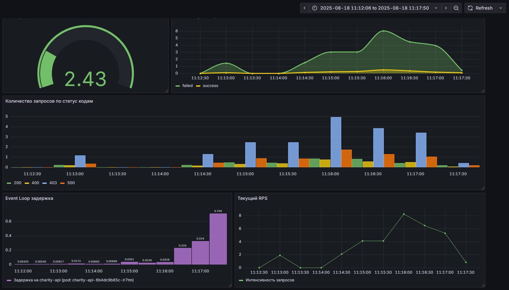
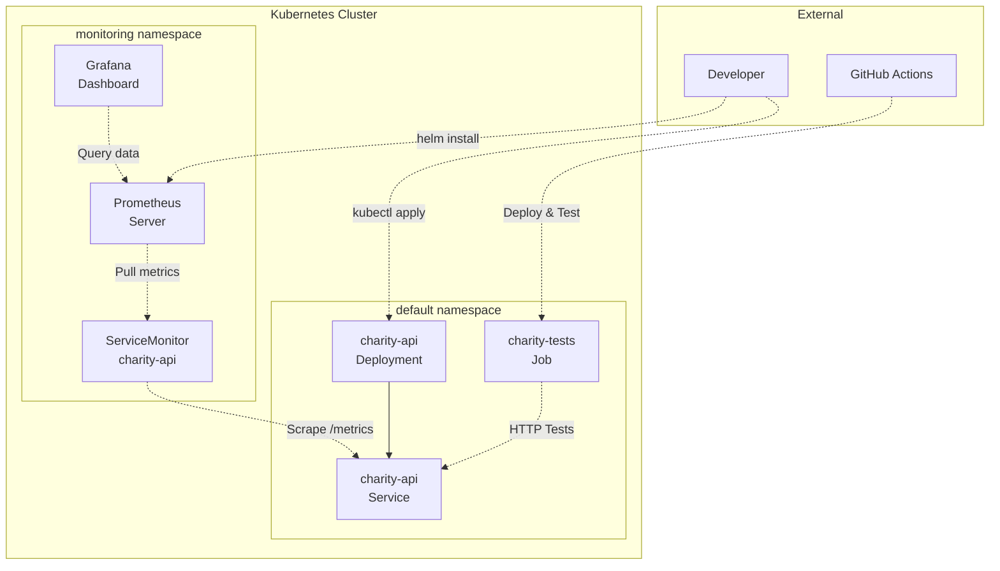

# Проект автоматизации тестирования API "Charity Event"

[](https://github.com/ZhikharevAl/fake_it_till_you_make_it/actions/workflows/code-quality.yaml)     [](https://deepwiki.com/ZhikharevAl/fake_it_till_you_make_it) 

## Описание

Этот репозиторий содержит набор автоматизированных тестов для API бэкенда "ExpressJS API". Проект был разработан на основе хакатона на тему **"Помощь пожилым людям"**. Цель проекта — обеспечить качество и стабильность API, используемого для управления пользователями, их авторизацией, избранными запросами и запросами о помощи.

Тесты написаны на Python с использованием pytest и Playwright (для взаимодействия с API).

## Содержание

* [Основные возможности и покрытие](#основные-возможности-и-покрытие)
* [Технологический стек](#технологический-стек)
* [Структура проекта](#структура-проекта)
* [Установка и настройка](#установка-и-настройка)
* [Запуск тестов](#запуск-тестов)
  * [Локальный запуск pytest](#локальный-запуск-pytest)
  * [Запуск в контейнерах Podman (сеть)](#запуск-в-контейнерах-podman-сеть)
  * [Развертывание в Kubernetes](#развертывание-в-kubernetes)
  * [Просмотр отчетов](#просмотр-отчетов)
* [Тестирование с Моками](#тестирование-с-моками)
* [Мониторинг и наблюдаемость](#мониторинг-и-наблюдаемость)
* [CI/CD](#инструменты-контроля-качества)
* [Планы и улучшения](#планы-и-улучшения)

## Основные возможности и покрытие

На данный момент проект включает тесты для следующих эндпоинтов:

* **Аутентификация:**
  * `POST /api/auth`: Вход пользователя и получение JWT токена.
* **Управление пользователем:**
  * `GET /api/user`: Получение данных профиля текущего пользователя.
  * `GET /api/user/favourites`: Получение списка избранных запросов.
  * `POST /api/user/favourites`: Добавление запроса в избранное.
  * `DELETE /api/user/favourites/{requestId}`: Удаление запроса из избранного.
* **Запросы помощи:**
  * `GET /api/request`: Получение списка всех запросов помощи.
  * `GET /api/request/{id}`: Получение деталей конкретного запроса.
  * `POST /api/request/{id}/contribution`: Внесение вклада в запрос.

## Технологический стек

* **Язык:** Python 3.13+
* **Тест-фреймворк:** pytest
* **HTTP Клиент:** Playwright (APIRequestContext)
* **Валидация данных:** Pydantic
* **Отчетность:** Allure Report
* **Мокирование:** `unittest.mock` (через `MockHTTPClient` и `MockFactory`)
* **Менеджер пакетов:** uv
* **Контейнеризация:** Podman / Docker
* **Оркестрация:** Kubernetes
* **Мониторинг:** Prometheus + Grafana
* **CI/CD:** GitHub Actions

## Структура проекта

```bash
.
├── .github/          # Настройки CI/CD (GitHub Actions)
│   ├── actions/      # Reusable actions (setup, run-linters)
│   └── workflows/    # Пайплайны CI/CD
├── api/              # Клиенты API и модели данных (Pydantic)
│   ├── auth/
│   ├── request/
│   └── user/
├── config/           # Конфигурационные файлы (базовый URL, таймауты)
├── core/             # Базовые компоненты фреймворка (HTTP клиент, MockHTTPClient)
├── infra/            # Инфраструктурные конфигурации
│   ├── k8s/          # Kubernetes манифесты и Helm чарт
│   │   ├── Chart.yaml                      # Helm чарт для Charity API
│   │   ├── charity-api-deployment.yaml     # Deployment и Service для API
│   │   ├── charity-api-servicemonitor.yaml # ServiceMonitor для Prometheus
│   │   ├── charity-tests-job.yaml          # Job для запуска тестов в K8s
│   │   └── prometheus-rbac.yaml            # RBAC для Prometheus
│   └── monitoring/   # Конфигурации мониторинга
│       ├── values-grafana.yaml             # Helm values для Grafana
│       └── values-prometheus.yaml          # Helm values для Prometheus
├── tests/            # Тестовые сценарии pytest
│   ├── auth/         # Тесты аутентификации (+ test_auth_api_mocked.py)
│   ├── mocks/        # Инфраструктура для мок-тестов (фикстуры, хендлеры, данные)
│   ├── request/      # Тесты запросов помощи (+ test_request_api_mocked.py)
│   └── user/         # Тесты пользователя (+ test_user_api_mocked.py)
├── utils/            # Вспомогательные утилиты (Allure, хелперы, MockFactory)
├── .env.example      # Пример файла с переменными окружения
├── .gitignore
├── Containerfile        # Containerfile для сборки образа тестов
├── pyproject.toml    # Определение зависимостей и конфигурация инструментов
└── README.md
```

## Установка и настройка

1. **Клонировать репозиторий:**

    ```bash
    git clone https://github.com/ZhikharevAl/fake_it_till_you_make_it.git
    cd fake_it_till_you_make_it
    ```

2. **Установить Python** (версия 3.13 или выше).
3. **Установить `uv`** (если еще не установлен):

    ```bash
    curl -LsSf https://astral.sh/uv/install.sh | sh
    # Не забудьте добавить путь к uv в PATH
    ```

4. **Создать и активировать виртуальное окружение**:

    ```bash
    uv venv
    source .venv/bin/activate # Linux/macOS
    # .\.venv\Scripts\activate # Windows
    ```

5. **Установить зависимости:**

    ```bash
    uv pip install -e '.[dev]'
    ```

6. **Настроить окружение:**
    * Создайте файл `.env` из `.env.example` (если его нет).
    * Заполните `.env` необходимыми значениями: `API_BASE_URL`, `TEST_USER_LOGIN`, `TEST_USER_PASSWORD`, `INVALID_USER_PASSWORD`. **Примечание:** `API_BASE_URL` будет разным для локального запуска, запуска в Podman и Kubernetes (см. ниже).

## Запуск тестов

### Локальный запуск pytest

Этот способ подходит, если API сервер запущен локально (не в контейнере).

1. **Убедитесь, что API сервер запущен** и доступен по адресу, указанному в `API_BASE_URL` вашего `.env` файла (например, `http://localhost:4040`).
2. **Активируйте виртуальное окружение**: `source .venv/bin/activate`.
3. **Запустите все тесты:**

    ```bash
    pytest
    ```

4. **Запустите только интеграционные тесты:**

    ```bash
    pytest -m "not mocked"
    ```

5. **Запустите только мок-тесты:**

    ```bash
    pytest -m mocked
    ```

### Запуск в контейнерах Podman (сеть)

Этот способ запускает и API сервер, и тесты в отдельных контейнерах, соединенных через сеть Podman. Это обеспечивает лучшую изоляцию.

**Предварительные требования:**

* Установлен Podman.  [Инструкции по установке](https://podman.io/getting-started/installation).
* Собран образ для API сервера (например, `api-server-image:local`). [Инструкции по сборке](https://github.com/ZhikharevAl/charity_event_comeback_oct2024.git).
* Собран образ для тестов из этого репозитория (например, `charity-tests-runner:local`):

  ```bash
  podman build -t charity-tests-runner:local -f Containerfile .
  ```

**Шаги запуска:**

1. **Создайте сеть Podman** (если еще не создана):

    ```bash
    podman network create my-test-net
    ```

2. **Настройте `.env` файл:** Убедитесь, что в вашем `.env` файле (в корне этого репозитория) `API_BASE_URL` указывает на имя контейнера сервера и его внутренний порт:

    ```dotenv
    API_BASE_URL=http://api-server:4040
    # Остальные переменные TEST_USER_LOGIN и т.д.
    ```

3. **Запустите контейнер с API сервером** в созданной сети:

    ```bash
    podman run -d --rm --network my-test-net --name api-server api-server-image:local
    ```

4. **Запустите контейнер с тестами** в той же сети, передав `.env` файл:

    ```bash
    podman run --rm --network my-test-net --env-file .env charity-tests-runner:local
    ```

5. **Остановите контейнер сервера** после завершения тестов:

    ```bash
    podman stop api-server
    ```

### Развертывание в Kubernetes

Проект поддерживает развертывание в кластере Kubernetes с полным стеком мониторинга.

**Предварительные требования:**

* Установлен `kubectl` и настроен доступ к кластеру Kubernetes
* Установлен Helm 3
* Собраны Docker образы для API и тестов:

  ```bash
  # Соберите образ API (в репозитории API)
  docker build -t localhost/charity-api:latest .

  # Соберите образ тестов (в этом репозитории)
  docker build -t localhost/charity-tests:latest -f Containerfile .
  ```

**Развертывание API:**

1. **Примените манифесты для API:**

    ```bash
    kubectl apply -f infra/k8s/charity-api-deployment.yaml
    ```

2. **Создайте секрет для тестовых данных:**

    ```bash
    kubectl create secret generic charity-tests-secret \
      --from-literal=TEST_USER_LOGIN="your_test_user" \
      --from-literal=TEST_USER_PASSWORD="your_test_password" \
      --from-literal=INVALID_USER_PASSWORD="invalid_password"
    ```

3. **Запустите тесты как Job:**

    ```bash
    kubectl apply -f infra/k8s/charity-tests-job.yaml
    ```

4. **Проверьте результаты тестов:**

    ```bash
    kubectl logs job/charity-tests
    ```

**Развертывание мониторинга:**

1. **Установите kube-prometheus-stack:**

    ```bash
    helm repo add prometheus-community https://prometheus-community.github.io/helm-charts
    helm repo update

    # Установка Prometheus
    helm install kp-stack prometheus-community/kube-prometheus-stack \
      -f infra/monitoring/values-prometheus.yaml \
      --namespace monitoring --create-namespace

    # Установка Grafana (опционально, если не входит в kube-prometheus-stack)
    helm install grafana grafana/grafana \
      -f infra/monitoring/values-grafana.yaml \
      --namespace monitoring
    ```

2. **Примените RBAC для Prometheus:**

    ```bash
    kubectl apply -f infra/k8s/prometheus-rbac.yaml
    ```

3. **Активируйте мониторинг API:**

    ```bash
    kubectl apply -f infra/k8s/charity-api-servicemonitor.yaml
    ```

4. **Получите доступ к Grafana:**

    ```bash
    kubectl port-forward -n monitoring svc/grafana 3000:80
    # Откройте http://localhost:3000 в браузере
    # Логин: admin, пароль: см. в секрете grafana
    ```

**Использование Helm Chart:**

Альтернативно, вы можете использовать Helm Chart:

```bash
# Установка API через Helm
helm install charity-api ./infra/k8s \
  --set image.tag=latest \
  --set image.repository=localhost/charity-api
```

### Просмотр отчетов

1. **Сгенерируйте Allure отчет** (если запускали с `--alluredir`):

    ```bash
    allure generate allure-results --clean
    ```

2. **Откройте отчет в браузере:**

    ```bash
    allure open
    ```

    Или используйте `allure serve allure-results`.

## Тестирование с Моками

В проекте реализованы мок-тесты для изоляции от реального бэкенда и обеспечения стабильности и скорости CI.

* **Подход:** Используется **мокирование на уровне Python клиента** с помощью библиотеки `unittest.mock`. Создан специальный класс `MockHTTPClient` (`core/mock_http_client.py`), который наследуется от реального `HTTPClient`, но перехватывает вызовы методов (`get`, `post` и т.д.) и возвращает заранее настроенные ответы (`unittest.mock.Mock`), имитирующие `APIResponse`. Для удобной настройки этих мок-ответов используется класс-фабрика `MockFactory` (`utils/mock_factory.py`).
* **Структура:** Инфраструктура для моков (фикстуры для `MockHTTPClient` и `MockFactory`, мок-данные) находится в папке `tests/mocks/`. Тестовые файлы с моками (например, `test_auth_api_mocked.py`) используют фикстуры мокированных API клиентов (например, `mock_auth_client`) и `MockFactory` для настройки ожидаемых ответов перед вызовом методов клиента.
* **Запуск:** Мок-тесты помечены маркером `mocked` (`pytest -m mocked`).

## Мониторинг и наблюдаемость

Проект включает полный стек мониторинга для отслеживания производительности API и результатов тестирования:

### Компоненты мониторинга

* **Prometheus**: Сбор метрик из API приложения через endpoint `/metrics`
* **Grafana**: Визуализация метрик и создание дашбордов
* **ServiceMonitor**: Автоматическое обнаружение сервисов для мониторинга

### Настройка мониторинга

1. **Метрики API**: API должен экспортировать метрики на endpoint `/metrics` (Prometheus format)
2. **ServiceMonitor**: Автоматически обнаруживает API сервис и настраивает сбор метрик каждые 15 секунд
3. **Health checks**: Kubernetes проверяет здоровье API через endpoint `/health`

### Доступ к мониторингу

* **Prometheus UI**: `kubectl port-forward -n monitoring svc/kp-stack-kube-prometheus-s-prometheus 9090:9090`
* **Grafana UI**: `kubectl port-forward -n monitoring svc/grafana 3000:80`
* **API Metrics**: `kubectl port-forward svc/charity-api 4040:4040` → `http://localhost:4040/metrics`

### Пример метрик для мониторинга

```prometheus
# Количество HTTP запросов
http_requests_total{method="GET",status="200",endpoint="/api/user"}

# Время отклика API
http_request_duration_seconds{method="POST",endpoint="/api/auth"}

# Активные соединения
active_connections

# Ошибки аутентификации
auth_failures_total
```



## Инструменты контроля качества

Проект использует GitHub Actions для автоматической проверки качества кода (linting, formatting, type checking) и запуска тестов при каждом пуше. Используется Podman для запуска интеграционных тестов в контейнеризованном окружении. Результаты тестов и отчет о покрытии загружаются автоматически. Allure отчет генерируется и деплоится на GitHub Pages.

**Интеграция в рабочий процесс разработки**


**Allure отчёт**


**Покрытие тестами**


## Архитектура развертывания



## Планы и улучшения

* **Стабилизация API:** Основная цель — добиться стабильной работы реального API сервера, чтобы убрать метки `xfail` из интеграционных тестов.
* **Расширение покрытия:** Добавить больше негативных тестов, тестов на граничные значения для всех эндпоинтов (как интеграционных, так и моков).
* **Улучшение обработки данных:** Использовать фабрики данных или `faker` для генерации тестовых данных, особенно в моках.
* **Автоскейлинг:** Настройка HPA (Horizontal Pod Autoscaler) для API при увеличении нагрузки.
* **Безопасность:** Добавление Network Policies и Pod Security Standards.
* **Helm Charts:** Развитие Helm Chart для упрощения развертывания всего стека.
